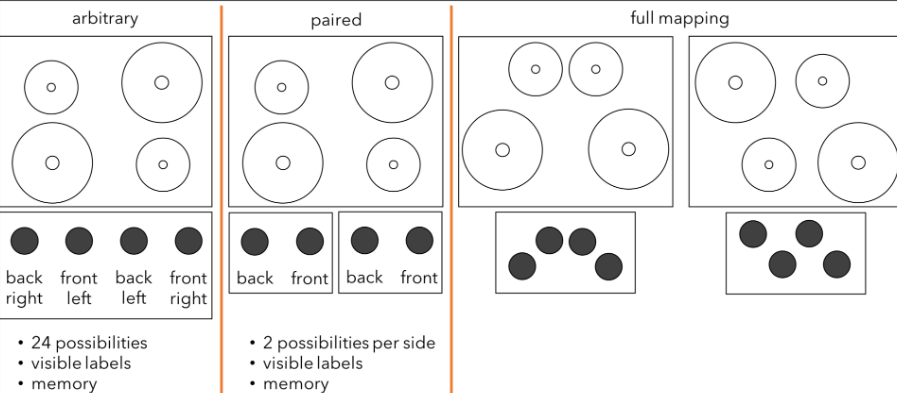
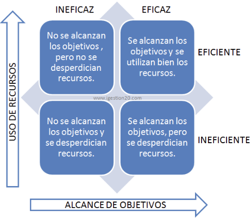
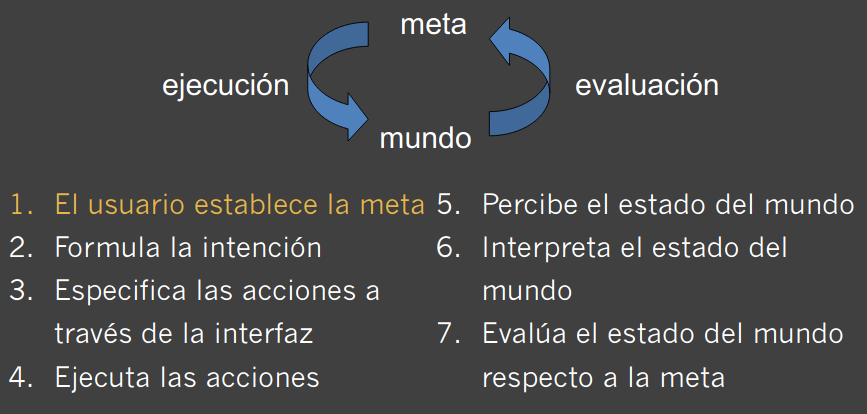
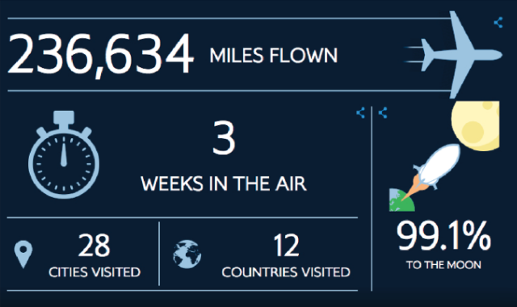
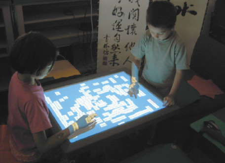
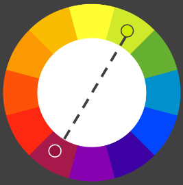
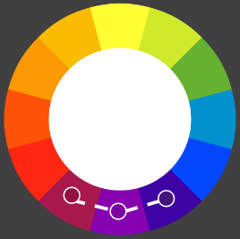

# TEMA 1: INTERACCIÓN PERSONA ORDENADOR (IPO)
---
## Factores de diseño
Los objetos tienen que **diseñarse para que puedan ser usados**, teniendo en cuenta los siguientes factores:

* **Visibilidad**
* **Causabilidad**: Buena representación de los efectos.
* **Restricciones visibles**
* **Coincidencia (mapping)**: Su diseño debe sugerir su funcionalidad.

> 

* **Efectos de transferencia**: un procesador de texto y una maquina de escibir.
* **Estereotipos de los usuarios**: Iconos que todos entendemos, aunque ya no se usen, por ejemplo para seleccionar el contacto de alguien incluir un icono de un teléfono antiguo (como hace whatsApp)
* **Modelos conceptuales**
* **Diferencias individuales, culturales...**

**Buen ejemplo**

> *En resumen, la gente tiene modelos mentales de como funcionan las cosas (aunque estos modelos pueden ser erróneos), por lo que hay que encontrar modelos que tengan un equilibrio entre utilidad y diseño.*

## Nacimiento de la IPO: La manipulación directa
* 1963: primer ratón
* 1981: primer dispositivo comercial con ratón
* 1984: primer odernador comercial exitoso (el de Apple)

## Objetivos de la IPO
El principal objetivo es desarrollar o mejorar:
* **Seguridad**: Los mandos de un avión.
* **Utilidad**: Indica que puede hacer el sistema.
* **Efectividad**: Poner juntos los botones de salir y borrar.
* **Eficiencia**: El botón más usado debe ser el más cercano.
* **Usabilidad**: Fácil de usar y fácil aprendizaje.
    * Encontrar factores que determinan cómo se usan los ordenadores.
    * Desarrollar herramientas que ayudan a los diseñadores a crear sistemas eficientes.
    * Alcanzar una iteración eficiente, efectiva y segura.

> 

## Concepto de iteración
Es el proceso de comunicación entre el usuario y el sistema por medio de una interfaz, la cual se debe de diseñar para que la interacción tenga éxito.

## Concepto de modelo de interacción
Un modelo es una representación abstracta de una realidad compleja que se utiliza para facilitar su comprensión y el estudio de su comportamiento.

* **Dominio**: Un área de habilidad y conocimiento en alguna actividad del mundo real. ***Ej: administración pública.***
* **Meta**: Qué quiere conseguir el usuario. ***El: realizar una solicitud.***
* **Tarea**: Cómo quieres conseguir tu meta. ***Carta o email***
* **Acciones**: Una tarea(no implica la resolución del problema). ***Ej por carta: redactar la carta, franquear la carta, remitir la carta.***
* **Plan**: Conjunto de tareas para conseguir una meta.

### Modelo de Norman
El usuario formula y ejecuta un plan de acciones utilizando la interfaz del sistema.

Cuando ejecuta estas acciones observa la interfaz para evaluar el resultado y comprobar si hacen falta más acciones.

* **Lenguaje del sistema** -> lenguaje del núcleo, representa atributos computacionales del dominio relevantes para representar el estado del sistema.

* **Lenguaje del usuario** -> lenguaje de la tarea, atributos psicológicos del dominio relevantes para representar el estado del usuario.

> 

### ¿Problema de las interfaces? Abismo de evaluación
Distancia entre la representación física del estado del sistema y lo que esperaba el usuario. *El usuario y el sistema no hablan el mismo lenguaje.*

---
# TEMA 2.1: INTERFACES DE USUARIO
## ¿QUÉ ES LA INTERFAZ DE USUARIO?
Canal a través del cual se produce la comunicación entre el usuario y el ordenador.

Debe diseñarse para que esta tarea se haga de forma eficiente y satisfactoria.

## TIPOS DE INTERFACES
### 1. Basada en comandos
* Se ejecutan los resultados en un terminal y el sistema responde con el resultado correspondiente.

* **Eficiente, precisa y veloz**, sin embargo puede resultar difícil de aprender.

* Alternativa para personas con discapacidad visual.

### 2. WIMP y GUI

* **WIMP** = Windows(ventanas), Icons, Menus, Pointing device(puntero).

* Si se abren más ventanas podría resultar difícil gestionarlas y para ello se tiene la posibilidad de reducirlas a un icono en la barra de estado, listar todas las que están abiertas  o moverse fácilmente de una a otra.

* POSIBLES VENTANAS:

    * **MDI**: Todo el programa se basa en una ventana principal que funciona como espacio de trabajo. Las ventanas hijos se minimizan dentro de las del padre, lo que aumenta la complejidad visual de la pantalla.
        * **Ventajas**:
            * Los recursos del sistema se conservan
            * No se produce sensación de abarrotamiento visual
            * Proporcionan un espacio de trabajo coordinado
            * Se pueden ver múltiples documentos a la vez

        * **Desventajas**:
            * Los menús cambian de acuerdo con el documento seleccionado, lo cual implica mayor dificultad de aprendizaje
            * Las ventanas de documento tienen que estar dentro del área de trabajo, lo cual elimina la ventaja de tener varias pantallas

    * **SDI**: Se centra en el **documento**. Una aplicación SDI abre una nueva ventana principal para cada documento con el que se quiera trabajar
        * **Ventajas**:
            * Al estar centrado en un único documento, todos los menús y barras de herramientas reflejan la visión del usuario
            * Son menos complejas visualmente
        * **Desventajas**:
            * No hay forma de agrupar ventanas de documentos que, si bien son distintos, están relacionados
            * La barra de tareas puede aparecer llena cuando hay demasiados documentos abiertos
            * La transición entre ventanas puede ser compleja
    * **TDI**: Es una variante de MDI, incorporando pestañas para cambiar entre documentos.
    * **Cajas de diálogo**: sirven para gestionar las propiedades de un objeto, ejecutar funciones, confirmar acciones...
        * **Modales**: si no se puede hacer otra cosa hasta que se terminen las acciones de la caja de diálogo.
        * **No modales**: si se puede hacer otra cosa con la caja abierta.

* OTROS ELEMENTOS:

    * **Pestañas**: Permiten incrementar el tamaño del diálogo apilando niveles y facilitan que se acceda a más elementos.

    * **Iconos**: Los iconos son más fáciles de aprender y recordar que los comandos

    Se pueden diseñar para ocupar poco espacio y moverse en la pantalla

    Actualmente son muy utilizados en todas las interfaces para objetos del escritorio, herramientas, aplicaciones y acciones

    * **Menús**: En forma de listas, luego éstas pueden ser expansibles, o dependiendo el contexto.

### 3. Multimedia

Combinación de diferentes media en la misma interfaz ofreciendo diferentes modos de interactuar.

Mejora el aprendizaje y la aceptación por parte de los usuarios.

Se utiliza en particular en juegos o para representar historias con diferentes tipos de contenidos.

### 4. Realidad Virtual
La realidad virtual es una simulación gráfica generada por ordenador que genera “la ilusión de participar en un entorno no real en vez de observarlo desde el exterior”.

### 5. Tableros
Tableros gráficos para visualizar datos complejos.

Mejoran la capacidad de pensamiento y aprendizaje, reconociendo patrones en los datos visualizados.

> 

### 6. Móvil
Para diseñar un menú para móviles hay que tener en cuenta las reducidas dimensiones de las pantallas, las nuevas formas de interacción con los usuarios (por ejemplo el multi-touch), y otras características relevantes.

Muchas aplicaciones no se han diseñado para contestar a una necesidad especifica, si no para la diversión.

### 7. Voz
Siri, Alexa, Google Home.

### 8. Compartida
Para ello, se utilizan pantallas de grandes dimensiones donde las personas interactúan con gestos o toques o pantallas horizontales donde grupos de personas acceden a la misma información.

> 

---
# TEMA 2.2: USABILIDAD
El sistema tiene que hablar el *mismo lenguaje del usuario*.

* Demasiadas opciones representan una carga adicional de información para los usuarios que tendrán que hacer un esfuerzo extra para aprender, entender y buscar. Como consecuencia, habrá más posibilidades de error.

* La información así como las funcionalidades del sistemas se deberían presentar con un lenguaje natural e iconos fáciles de entender, evitando términos técnicos.

* Hay que garantizar una correspondencia entre lo que visualiza el sistema y el modelo mental que se ha construido el usuario.

La **experiencia del usuario** está formado por todos los aspectos de la interacción del usuario con el programa, mientras que la **usabilidad** abarca si el sistema es fácil de aprender, eficiente de usar, agradable...

* Fácil de usar
* Fácil de aprender
* Efectivo
* Eficiente
* Útil
* Seguro

#### Metáforas
Para eliminar documentos se utiliza la metáfora del cubo de basura, trituradora de papel etc. Hay que tener cuidado con la internacionalización de la página, ya que las metáforas podrían cambian de significado.

## El ser humano
Hay que tener en cuenta varios factores relacionados con el ser humano para poder diseñar una interfaz usable.
### 2.1 Percepción visual
Leyes de la percepción visual o leyes de la Gestalt:
* **Ley de cierre**: completar con la imaginación las formas percibidas.

* **Ley de la figura y fondo**: el fondo enmarca a la figura y por su menor contraste tiende a no ser percibido.

* **Ley de la simplicidad**: los elementos se perciben de la manera más simple.

* Mayor brillo significa mayor agudeza visual y mayor frecuencia de parpadeo.

* **Colores**:
    * Se aconseja utilizar entre 5 y 7 colores, donde los grises claros son los más idóneos como color de fondo.

    * La interfaz se debería poder utilizar en blanco y negro teniendo en cuenta los usuarios con problemas de daltonismo.

    * **Colores cálidos**: Pasión, alegría, entusiasmo y energía.

    * **Colores fríos**: Calma y profesionalismo.

    * **Complementarios**: Se utilizan para generar un fuerte contraste.
    > 

    * **Análogos**: base de esquemas armónicos.
    > 

    * **Triádica, split complementarios, tetrádica, esquema cuadrado**

### 2.2 El movimiento
Movimiento de las manos, brazos, etc

La velocidad de reacción y la precisión mejoran con la práctica (por ejemplos, avanzando en los niveles de videojuegos).

### 2.3 La memoria
* Memoria **sensorial**: icónica, ambiental y del tacto.

* Memoria a **corto plazo**: información fugaz y capacidad limitada
    * *Por ejemplo, hasta 30 segundos y 7±2 elementos*

* Memoria a **largo plazo**: tiempo indefinido y capacidad ilimitada. Información experimental y comportamientos.
    * Ejemplo, recordar el número de teléfono antiguo al memorizar el nuevo.

### 2.4 El pensamiento
* **Deductivo** (derivación lógica): “Pedro es una persona. Las personas comen pescado. Pedro come pescado”

* **Inductivo** (generalización de casos): “Veo un avión con hélices y ruedas, entonces todos los aviones las tienen”

* **Abductivo** (explicación para efectos observados): “Santi corre mucho con el coche cuando bebe. Si vemos a Santi a mucha velocidad, Santi ha bebido.”

## Principios de diseño
